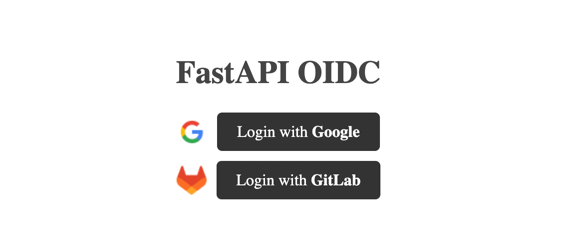

# fastapi-oidc: OpenID Connect Plugin for FastAPI

**fastapi-simple-oidc** is a simple, configurable plugin for enabling OpenID Connect (OIDC) authentication in a FastAPI application. It supports multiple identity providers, session management, and callbacks for handling login and logout events.

## Features

- **OpenID Connect (OIDC)** integration for authentication.
- Support for popular Identity Providers like Google, Microsoft, Apple, GitLab, Salesforce, and IBM.
- Support for any custom OIDC backend.
- Easy provider discovery using `.well-known/openid-configuration`.
- Session-based user management using `SessionMiddleware`.
- Callbacks for `on_login` and `on_logout` to customize user handling behavior.
- Pre-built routes for login, logout, user information, and provider discovery.
- Extendable to additional identity providers.

---

## Installation

```bash
pip install fastapi-simple-oidc
```

---

## Quick Start

Here’s a quick guide to get you started with FastAPI and OIDC.

### 1. Setup your FastAPI application

```python
from fastapi import FastAPI
from fastapi_oidc import OIDC

app = FastAPI()

# Create an OIDC instance
oidc = OIDC(
    app=app,
    secret_key="your-session-secret",  # A secure key for the application session
    login_url='/login',                # Optional: Redirect URL for login page
    redirect_url='/dashboard'          # Optional: URL to redirect to after login
)

# Register OIDC routes
app.include_router(oidc.router)
```

---

### 2. Configure Identity Providers

Identity provider configurations must be set using environment variables or configuration files.

#### Environment Variable Example:

```env
SSO_GOOGLE_ID=<google-client-id>
SSO_GOOGLE_SECRET=<google-client-secret>

SSO_MICROSOFT_ID=<microsoft-client-id>
SSO_MICROSOFT_SECRET=<microsoft-client-secret>
SSO_GOOGLE_NAME=Custom Google Name  # Optional: Display name for Google

# also Custom Provider
SSO_CUSTOM_ID=
SSO_CUSTOM_SECRET=
SSO_CUSTOM_URL=
SSO_CUSTOM_NAME=
```

#### Built-in Identity Providers

The library supports the following providers out of the box, you don't need to specify `NAME` and `URL`

- Google
- Microsoft
- Apple
- GitLab
- Salesforce
- IBM

---

### 3. Add Login and Logout Callbacks (Optional)

You can define custom logic that runs after login or logout events using the `on_login` and `on_logout` decorators.

```python
from fastapi_oidc import OpenID

@oidc.on_login
def handle_login(user: OpenID):
    print(f"User logged in: {user.name} ({user.email})")

@oidc.on_logout
def handle_logout(user: OpenID):
    print(f"User logged out: {user.email}")
```

---

### 4. Secure Your Routes with Authentication

Use the `get_logged_user` dependency to secure your endpoints and access the currently authorized user.

```python
from fastapi_oidc import get_logged_user, OpenID

@app.get("/protected")
async def protected_endpoint(user: OpenID = Depends(get_logged_user)):
    return {"message": f"Welcome {user.name}", "email": user.email}
```

Exception raised for unauthorized users:
- **401 Unauthorized**: If the user is not authenticated.

---

### 5. Test the Integration

Visit the built-in test page at the `/.test` route to verify the setup:
- List all available Identity Providers.
- Attempt login/logout.
- Check the current session.


---

## Routes

The plugin automatically registers the following routes:

| **Route**              | **Description**                                                              |
|------------------------|------------------------------------------------------------------------------|
| `/<provider>/login`    | Login redirection page.                                                      |
| `/<provider>/callback` | OIDC callback                                                                |
| `/logout`              | Clears the session and logs the user out.                                    |
| `/me`                  | Returns the details of the currently logged-in user. Uses `get_logged_user`. |
| `/providers`           | Lists all available identity providers.                                      |
| `/.test`               | A pre-built test page to test your OIDC configuration.                       |

Each Identity Provider will also have its own login and callback routes under `<provider>/login` and `<provider>/callback`.

---

## Environment Variables Reference

The following environment variables can be set to configure available identity providers:

| **Variable**                | **Required**                          | **Description**                                           |
|-----------------------------|---------------------------------------|-----------------------------------------------------------|
| `SSO_<PROVIDER>_ID`         | Yes                                  | The client ID for the identity provider.                  |
| `SSO_<PROVIDER>_SECRET`     | Yes                                  | The client secret for the identity provider.              |
| `SSO_<PROVIDER>_URL`        | Only if not a default provider       | The OpenID Connect discovery URL of the identity provider.|
| `SSO_<PROVIDER>_NAME`       | No                                   | Custom display name for the provider in `/providers`.     |

---

## Extending

### Add New Providers

You can integrate custom providers by adding their configuration into environment variables as shown earlier. The package uses the `.well-known/openid-configuration` standard to fetch OpenID Connect metadata, so the provider needs to follow this specification.

---

## Example App

Here’s an example app using Google as an Identity Provider:

```python
from fastapi import FastAPI, Depends
from fastapi_oidc import OIDC, get_logged_user, OpenID

app = FastAPI()

oidc = OIDC(
    app=app,
    secret_key="random-secret-key",
    login_url='/login',
    redirect_url='/dashboard'
)

# Register OIDC routes
app.include_router(oidc.router)

# Secure route
@app.get("/dashboard")
async def dashboard(user: OpenID = Depends(get_logged_user)):
    return {"message": f"Hello, {user.name}!", "email": user.email}

@oidc.on_login
def handle_login(user: OpenID):
    print(f"User logged in: {user.email}")

@oidc.on_logout
def handle_logout(user: OpenID):
    print(f"User logged out: {user.email}")
```

---

### Supported Defaults

When using the default providers, you don’t need to define URLs; they are managed internally.

---

## License

This project is licensed under the MIT License.